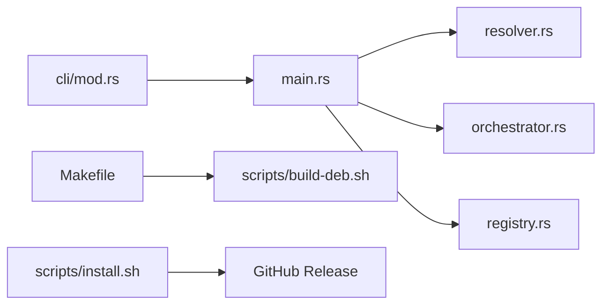

# lpkg 0.2.0: packaging, CLI, release

## Goals

- Make `lpkg` installable via **clone + make**, **one-liner install script**, **`.deb`**, and **`cargo install`**.
- Extend CLI: multi-id search/install, bulk `install --all`, and `--auto` on install/upgrade.
- Document every command (existing + new) in [README.md](README.md).
- Bump to **0.2.0**, tag `v0.2.0`, publish a GitHub release with artifacts.

## CLI behavior (concrete)

### Search (A + B + C)

In [`src/cli/mod.rs`](src/cli/mod.rs) / [`src/main.rs`](src/main.rs):

- Change `query: String` → `queries: Vec<String>` (one or more terms).
- `lpkg search firefox` — search all enabled backends for that term (existing behavior; document as C).
- `lpkg search firefox code` — run search for each term, merge/dedupe candidates.
- Empty `lpkg search` — error with usage hint (listing every package across apt/flathub/etc. is not useful); keep `--source` filter.

### Install (A + B + C)

- Change `id: String` → `ids: Vec<String>` so `lpkg install firefox code` installs each in order.
- Add `--all` + optional manifest path (default: look for `packages.json` in cwd, else fail with a clear message): installs every entry via existing import/install path (reuse logic from `cmd_import`).
- Keep `--source` / `--version` applying per install when a single id is used; with multiple ids, `--version` is rejected (or ignored with a warning) — **reject with error** for clarity.
- Document that without `--source`, resolver picks the best backend by `backend_priority` across all enabled backends (C).

### `--auto` (full item 2)

Clap long flag `--auto` (also accept short `-a`). User wrote `-auto`; we document `--auto` / `-a`.

**`lpkg install … --auto`**

- Before install, if the package is already installed (same canonical id, optionally same `--source`), uninstall it first (non-purge unless `--purge` is also passed later — do **not** add purge to install; use normal uninstall).
- Then install the new version. Record registry update as today.

**`lpkg upgrade --auto` / `lpkg upgrade` with no id**

- Bare `lpkg upgrade` or `lpkg upgrade --auto` with no package id ⇒ upgrade all outdated packages (same as today’s `--all`, but `--all` remains as an alias for clarity).
- `lpkg upgrade PKG --auto` ⇒ if outdated, upgrade without prompts; if not outdated, print that it’s up to date and exit 0.
- `lpkg upgrade --auto` with no id ⇒ for each outdated package (from `check_outdated`), upgrade; skip up-to-date. Prefer this over blind `upgrade_all` when `--auto` is set so only packages with known newer versions are touched; keep `upgrade --all` as backend-native `upgrade_all` for full backend refreshes.

Concrete upgrade matrix:

| Invocation | Behavior |
|---|---|
| `lpkg upgrade --all` | Backend `upgrade_all` (current) |
| `lpkg upgrade` or `lpkg upgrade --auto` | Upgrade only packages reported outdated |
| `lpkg upgrade PKG` | Upgrade that package if installed |
| `lpkg upgrade PKG --auto` | Upgrade only if outdated; no-op if current |
| `… --dry-run` | Print would-upgrade actions only |

### Recommended additional commands (implement lightweight ones)

Implement these small, high-value additions:

- **`lpkg info <id>`** — show installed copies + search candidates for one id (name, backends, versions, outdated). Helps before `--auto` reinstall.
- **`lpkg which <id>`** — print which backend(s) currently provide an installed package.
- **`lpkg version` / `--version`** — show lpkg version from Cargo (`clap` `version` from crate).

Defer (document as possible future, do not implement now): `lpkg history`, `lpkg sources`, interactive TUI.

## Packaging & install paths

Repo today only has a stub [`packaging/deb/control`](packaging/deb/control), README clone build, no Makefile/CI/tags.

Add:

1. **[`Makefile`](Makefile)** — targets: `build` (`cargo build --release`), `install` (copy binary + `data/` into `/usr/local` or `PREFIX`), `uninstall`, `deb` (invoke packaging script).
2. **[`scripts/install.sh`](scripts/install.sh)** — one-liner friendly: detect arch, download latest GitHub release binary **or** build from source if `cargo` present; install to `/usr/local/bin/lpkg` and ship `data/` to `/usr/local/share/lpkg/` (or XDG). Update config/data path loading in [`src/config.rs`](src/config.rs) to also look at system share path for bundled `aliases.toml` / `direct-deb-index.json`.
3. **[`scripts/build-deb.sh`](scripts/build-deb.sh)** — build release binary, stage `DEBIAN/control` from [`packaging/deb/control`](packaging/deb/control) (bump Version to 0.2.0), install binary + data files, run `dpkg-deb --build`.
4. **Clone install** (documented):
   ```bash
   git clone https://github.com/MatoloJr/lpkg.git && cd lpkg && make install
   ```
5. **Cargo**: set `repository` / `homepage` in [`Cargo.toml`](Cargo.toml); users can `cargo install --git https://github.com/MatoloJr/lpkg.git`.
6. **GitHub Actions** [`.github/workflows/release.yml`](.github/workflows/release.yml) — on tag `v*`: build release binary (linux amd64), build `.deb`, upload assets via `gh`/`softprops/action-gh-release`.

Bump version everywhere to **0.2.0**: [`Cargo.toml`](Cargo.toml), [`packaging/deb/control`](packaging/deb/control), lockfile via `cargo build`.

## Docs: command reference

Rewrite [README.md](README.md) Install section with: one-liner, clone+make, deb, cargo. Add a **Commands** section elaborating each:

| Command | What it does |
|---|---|
| `search [queries…]` | Search all enabled backends for each query; merge results |
| `install [ids…]` | Install each id via best (or `--source`) backend |
| `install --all [file]` | Install every package from a JSON manifest |
| `install … --auto` | Remove existing install of same id first, then install |
| `list` / `--outdated` / `--duplicates` | Inventory |
| `upgrade` / `--auto` | Upgrade outdated packages |
| `upgrade --all` | Run each backend’s full upgrade |
| `upgrade PKG [--auto]` | Upgrade one package ( `--auto` only if outdated) |
| `uninstall` / `--purge` | Remove package |
| `cleanup` | Backend cleanup / old revisions |
| `scan` | Refresh inventory cache |
| `doctor` | Health checks |
| `pin add\|remove\|list` | Pinning |
| `export` / `import` | Manifest round-trip |
| `info` / `which` | Inspect resolution |
| `completions` | Shell completions |
| `--version` | Print lpkg version |

## Release

After implementation and a local `cargo test` / `cargo build --release`:

1. Commit changes (when you ask to commit).
2. Create annotated tag `v0.2.0`.
3. Push tag and create GitHub release with notes summarizing packaging + CLI changes; attach binary and `.deb` (via workflow or `gh release create` after local build).

## Key code touchpoints



- [`src/cli/mod.rs`](src/cli/mod.rs) — new flags/args/subcommands
- [`src/main.rs`](src/main.rs) — `cmd_install`/`cmd_search`/`cmd_upgrade` loops + `--auto`; new `cmd_info` / `cmd_which`
- [`src/config.rs`](src/config.rs) — system data path fallback for packaged installs
- [`Cargo.toml`](Cargo.toml) — version 0.2.0 + metadata
- New: Makefile, scripts, workflow, README

## Out of scope

- Windows/macOS packaging
- Interactive confirmation prompts UI beyond current println style
- Changing backend package-manager semantics beyond orchestrated uninstall-then-install