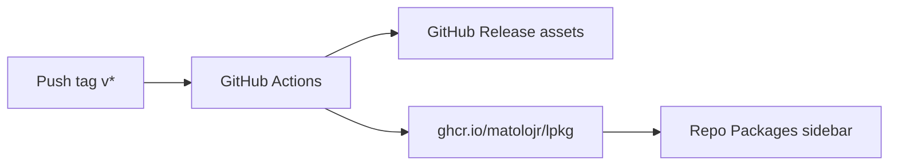

# Publish lpkg to GitHub Packages (GHCR)

## What the screenshot means

The repo sidebar **Packages** panel is **GitHub Packages**, not **Releases**.

| GitHub UI | What you already have / need |
|---|---|
| **Releases** | You already published `v0.2.0` (binary, tarball, `.deb`) that does **not** fill Packages |
| **Packages** | Needs a package in a supported registry: usually **Container (GHCR)**, npm, NuGet, Maven, RubyGems |

`lpkg` is a Rust CLI. Cargo publishes to [crates.io](https://crates.io), which also does **not** appear under the repo Packages sidebar. The standard way to make this tool show there is to publish a **Docker/OCI image** to **GitHub Container Registry** (`ghcr.io`).



## Approach (concrete)

Publish image `ghcr.io/matolojr/lpkg` (lowercase namespace required by GHCR) on each release tag, with OCI labels so it **links automatically** to [https://github.com/MatoloJr/lpkg](https://github.com/MatoloJr/lpkg).

### 1. Add [`Dockerfile`](Dockerfile)

Multi-stage build:

- Stage 1: `rust:1-bookworm` `cargo build --release`
- Stage 2: slim runtime (`debian:bookworm-slim`) with binary + `data/` under `/usr/local`
- Labels:
  - `org.opencontainers.image.source=https://github.com/MatoloJr/lpkg`
  - `org.opencontainers.image.description=...`
  - `org.opencontainers.image.licenses=MIT`

Entrypoint: `lpkg`.

### 2. Extend [`.github/workflows/release.yml`](.github/workflows/release.yml)

On existing `push: tags: v*` job (same workflow as release assets):

- `permissions: contents: write` **and** `packages: write`
- Login to `ghcr.io` with `GITHUB_TOKEN`
- Build and push tags:
  - `ghcr.io/matolojr/lpkg:0.2.0` (from tag without `v`)
  - `ghcr.io/matolojr/lpkg:latest`
- Prefer `docker/build-push-action` + `docker/metadata-action` for tags/labels

Publishing from the repo workflow with `GITHUB_TOKEN` is the path GitHub documents for auto-linking the package to the repository (so it shows under **Packages** on the repo page).

### 3. Make the package public (one-time UI step after first push)

First push may create a **private** package even on a public repo. After the workflow succeeds:

1. Open **https://github.com/MatoloJr/lpkg?tab=packages** (or profile → Packages → `lpkg`)
2. Package settings → **Change visibility** → **Public**
3. Confirm the package is connected to repository `MatoloJr/lpkg` (should be automatic via the OCI `source` label / Actions publish)

Then the sidebar should show the package instead of “No packages published”.

### 4. Docs touch

Short note in [`README.md`](README.md) and optionally [`index.html`](index.html) Install section:

```bash
docker pull ghcr.io/matolojr/lpkg:latest
docker run --rm ghcr.io/matolojr/lpkg:latest --version
```

Clarify: **Releases** = native Linux binaries/deb; **Packages** = container on GHCR.

### 5. Trigger publish

- After merging the Dockerfile + workflow changes to `main`, either:
  - Re-run by cutting a new tag (e.g. `v0.2.1`), or
  - Manually dispatch / re-run is not enough without a tag if the workflow only runs on `v*` **retag or bump to `v0.2.1`** and push the tag so the updated workflow runs and pushes to GHCR.

Default: bump patch to **0.2.1**, tag `v0.2.1`, so Packages gets a clean first publish without overloading the existing release story.

## What we will not do

- Will not treat GitHub Releases as Packages (wrong UI)
- Will not require crates.io for the Packages sidebar (crates.io is separate; can be a later optional step)
- Will not publish npm/NuGet (irrelevant for this CLI)

## Success criteria

- Package `lpkg` listed under the repo’s **Packages** sidebar
- Pull works: `docker pull ghcr.io/matolojr/lpkg:0.2.1`
- Package page linked to `MatoloJr/lpkg` with public visibility